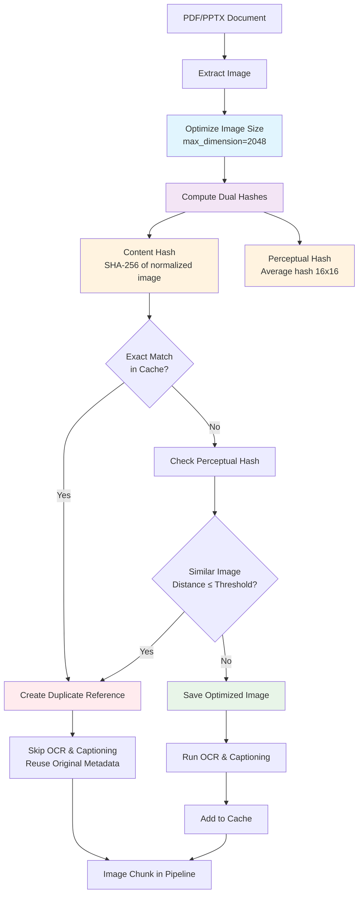

# Image Deduplication Guide

This guide explains the image deduplication feature implemented in Synapse to avoid saving duplicate images during parsing.

## Overview

When processing documents with `--extract-images`, Synapse now automatically detects and avoids saving duplicate images. Instead of saving multiple copies of the same image, it creates references that point to the original image file.

## How It Works

### Content-Based Detection
- **Dual Hashing System**: Uses both content-based and perceptual hashing for robust duplicate detection
- **Content Hashing**: Images are normalized and hashed based on their exact visual content
- **Perceptual Hashing**: Uses advanced algorithms to detect visually similar images even with minor differences
- **Smart Normalization**: Images are converted to RGB and resized to 512x512 for comparison
- **Format Independence**: Works across different image formats (PNG, JPG, etc.)
- **Similarity Threshold**: Configurable Hamming distance threshold for perceptual matching (default: 10)

### Deduplication Process
1. **Extract Image**: When an image is found in a PDF or PPTX
2. **Optimize Image**: Large images are automatically resized to improve processing speed while preserving OCR quality
3. **Compute Hashes**: Generate both content-based and perceptual hashes of the image
4. **Check Cache**: See if an image with matching content or similar perceptual hash was already processed
5. **Save or Reference**: 
   - If unique: Save optimized image file and add to cache
   - If duplicate: Create reference pointing to original image (skips OCR and captioning)

### Metadata Preservation
- **Original Images**: Full metadata including OCR text, captions, technical keywords
- **Duplicate References**: Point to original but preserve document context, page numbers, etc.

## Benefits

### Storage Savings
- **Reduced Disk Usage**: Only one copy of each unique image is saved
- **Faster Processing**: Duplicate images skip OCR and captioning steps
- **Cleaner Organization**: No redundant image files cluttering the output directory

### Improved Performance
- **Faster Extraction**: Duplicates are detected before expensive OCR/captioning
- **Smart Image Optimization**: Large images are automatically resized to improve processing speed
- **Reduced Memory Usage**: Less data to process and store
- **Quicker Retrieval**: Fewer files to search through
- **Perceptual Matching**: Detects similar images even with minor differences (compression, scaling, etc.)

## Usage

### Enable Image Extraction with Deduplication (Default)
```bash
# Single file processing
python pipeline/parse.py --extract-images --input Data/ --output artifacts/parsed.jsonl

# Folder-based processing  
python initialize_fast.py --verbose  # Images are extracted by default
```

### Disable Deduplication (Save All Images)
```bash
# If you want to save all images even if they're duplicates
python pipeline/parse.py --extract-images --disable-image-deduplication --input Data/

python initialize_fast.py --verbose  # Images are extracted by default --disable-image-deduplication
```

### View Deduplication Statistics
The parsing output shows deduplication statistics:
```
🖼️  IMAGE EXTRACTION:
   📷 Total images processed: 150
   ✨ Unique images saved: 95
   🔗 Duplicate references: 55
   💾 Images saved to: artifacts/extracted_images
   💡 Deduplication saved ~55 duplicate files
```

## Technical Details

### Dual Hash Algorithm
**Content Hash (Exact Matching):**
1. **Load Image**: Read image data from document
2. **Normalize Format**: Convert to RGB color space
3. **Standard Size**: Resize to 512x512 using high-quality resampling
4. **Generate Hash**: SHA-256 hash of normalized PNG data
5. **Store/Compare**: Use hash for exact duplicate detection

**Perceptual Hash (Similarity Matching):**
1. **Load Image**: Read image data from document  
2. **Convert to Grayscale**: Normalize color information
3. **Generate Hash**: Use average hash algorithm (16x16 grid)
4. **Calculate Distance**: Compare using Hamming distance
5. **Threshold Check**: Mark as duplicate if distance ≤ threshold

### Duplicate Reference Structure
```json
{
  "image_id": "duplicate_abc123...",
  "source_document": "/path/to/current/document.pdf",
  "page_number": 5,
  "image_path": "/path/to/original/image.png",
  "is_duplicate": true,
  "original_image_id": "original_def456...",
  "content_hash": "sha256_hash_value",
  "document_context": "Text from current page...",
  "ocr_text": "Reused from original...",
  "caption_text": "Reused from original..."
}
```

### Cache Behavior
- **Session Scope**: Deduplication cache persists across all files in a parsing session
- **Cross-Folder**: In folder-based parsing, deduplication works across all folders
- **Memory Only**: Cache is not persisted between parsing runs

## Common Scenarios

### Same Diagram in Multiple Documents
- **Situation**: Company logo appears on every page of multiple PDFs
- **Result**: Logo saved once, all other occurrences become references
- **Benefit**: Massive storage savings for repeated elements

### Presentation Template Images
- **Situation**: PowerPoint template images appear in every slide
- **Result**: Template elements saved once per presentation
- **Benefit**: Cleaner extraction focusing on unique content

### Cross-Document Sharing
- **Situation**: Same technical diagram used in multiple documents
- **Result**: Diagram saved from first document, referenced in others
- **Benefit**: Consistent metadata and reduced redundancy

## Configuration Options

### Command Line Flags
- `--extract-images`: Enable image extraction (required for deduplication)
- `--disable-image-deduplication`: Turn off deduplication (save all images)
- `--image-similarity-threshold N`: Set similarity threshold for perceptual hashing (0-64, default: 10)
- `--fast-image-extraction`: Enable fast mode for real-time updates (disables captioning, uses simpler OCR)
- `--images-output-dir`: Directory for saved images (default: artifacts/extracted_images)
- `--enable-image-captioning`: Enable AI captions (applied to unique images only)

### Programmatic Usage
```python
from pipeline.image_extractor import ImageDeduplicationCache, PDFImageExtractor

# Create shared cache with custom similarity threshold
dedup_cache = ImageDeduplicationCache(similarity_threshold=15)

# Standard mode (high quality, slower)
pdf_extractor = PDFImageExtractor(
    output_dir="my_images/",
    enable_captioning=True,
    dedup_cache=dedup_cache,
    fast_mode=False
)

# Fast mode for real-time updates
pdf_extractor_fast = PDFImageExtractor(
    output_dir="my_images/",
    enable_captioning=False,  # Automatically disabled in fast mode
    dedup_cache=dedup_cache,
    fast_mode=True
)

# Async processing for maximum performance
import asyncio
async def extract_async():
    images = await pdf_extractor_fast.extract_images_async("document.pdf")
    return images
```

### Similarity Threshold Guide
- **0-5**: Very strict matching (only nearly identical images)
- **6-10**: Default range (good balance of accuracy and detection)
- **11-20**: More permissive (catches images with minor variations)
- **21+**: Very permissive (may catch false positives)

### Performance Modes

#### Standard Mode (Default)
- **Quality**: High-quality OCR with technical corrections
- **Captioning**: Optional AI-generated captions
- **Speed**: ~3.1 images/second
- **Use Case**: Comprehensive document analysis

#### Fast Mode (`--fast-image-extraction`)
- **Quality**: Simplified OCR configuration
- **Captioning**: Automatically disabled
- **Speed**: ~4.0 images/second (**29% faster**)
- **Use Case**: Real-time knowledge base updates

#### Performance Benchmarks
Based on testing with a 6MB PDF containing 52 images:

| Mode | Speed | Small Doc (5 img) | Medium Doc (20 img) | Large Doc (50 img) |
|------|-------|-------------------|---------------------|-------------------|
| Standard | 3.1 img/sec | 1.6s | 6.4s | 16.1s |
| Fast | 4.0 img/sec | 1.2s | 5.0s | 12.4s |

✅ **Both modes are suitable for real-time small document updates**

## Troubleshooting

### False Positives (Different Images Detected as Duplicates)
- **Rare Occurrence**: Content-based hashing is very accurate
- **Resolution**: Use `--disable-image-deduplication` if needed
- **Investigation**: Check image metadata for content_hash values

### Missing Images
- **Check References**: Duplicate images point to original files
- **Verify Paths**: Ensure original image files weren't moved/deleted
- **Review Metadata**: Check `is_duplicate` and `original_image_id` fields

### Performance Issues
- **Large Images**: Very large images take more time to normalize and hash
- **Memory Usage**: Many unique images increase cache size
- **Disk I/O**: Normalization requires reading/processing image data

## Best Practices

1. **Keep Deduplication Enabled**: Default behavior saves storage and improves performance
2. **Monitor Statistics**: Check deduplication stats to understand your data
3. **Preserve Originals**: Don't manually delete "duplicate" image files
4. **Use Folder-Based Processing**: Maximizes deduplication across related documents
5. **Regular Cleanup**: Periodically clean up extracted_images directory if needed

## Real-Time Knowledge Base Updates

### Recommendations for Fast Updates

**For Real-Time Processing:**
```bash
# Optimal settings for real-time updates
python pipeline/parse.py \
    --extract-images \
    --fast-image-extraction \
    --input new_document.pdf \
    --output artifacts/parsed.jsonl
```

**Performance Expectations:**
- ✅ **Small documents (1-10 images)**: 1-3 seconds
- ✅ **Medium documents (10-30 images)**: 3-8 seconds  
- ⚠️ **Large documents (30+ images)**: 8+ seconds (consider background processing)

**Optimization Tips:**
1. **Use Fast Mode**: Add `--fast-image-extraction` flag
2. **Disable Captioning**: Captioning adds 1-3 seconds per image
3. **Process Incrementally**: Handle new documents as they arrive
4. **Background Processing**: For large documents, use async processing
5. **Cache Reuse**: Shared deduplication cache speeds up subsequent documents

### API Integration Example
```python
import asyncio
from pipeline.image_extractor import PDFImageExtractor, ImageDeduplicationCache

# Global cache for session persistence
global_cache = ImageDeduplicationCache()

async def process_document_realtime(pdf_path: str):
    """Process a document for real-time knowledge base update."""
    extractor = PDFImageExtractor(
        fast_mode=True,
        enable_captioning=False,
        dedup_cache=global_cache
    )
    
    # Async processing for maximum speed
    images = await extractor.extract_images_async(pdf_path)
    return images

# Usage
async def main():
    images = await process_document_realtime("new_document.pdf")
    print(f"Processed {len(images)} images in real-time")
```

## Integration with RAG Pipeline

The deduplication system is fully integrated with the RAG pipeline:
- **Chunk Creation**: Both unique and duplicate images become retrievable chunks
- **Query Retrieval**: Duplicate references work seamlessly in search results
- **Citation Display**: Proper source attribution maintained for all images
- **Context Preservation**: Document-specific context preserved even for duplicates

This ensures that deduplication is transparent to users while providing all the storage and performance benefits.
