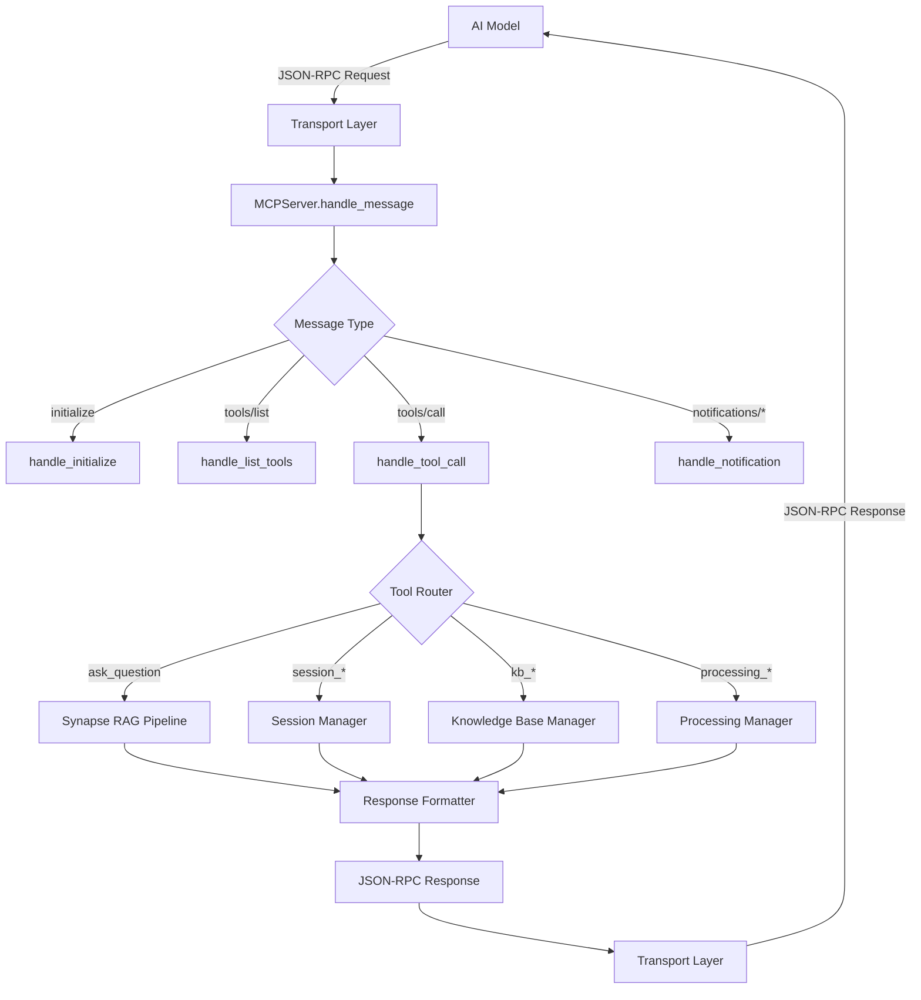
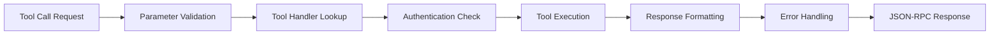
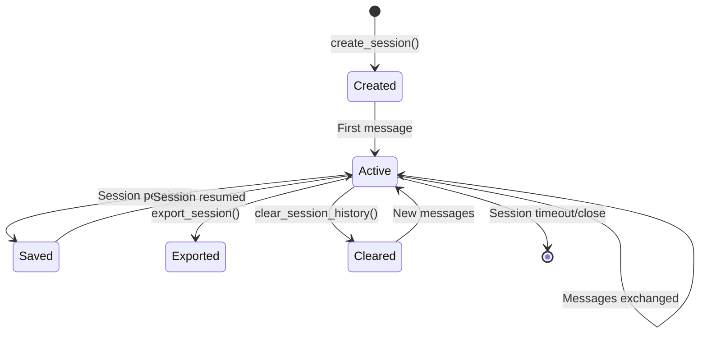

# 🏗️ Synapse MCP Server Architecture & Framework

This document provides a deep technical dive into the Synapse MCP (Model Context Protocol) server implementation, covering the architectural design, framework internals, and technical specifications.

## 📋 **Table of Contents**

1. [Architecture Overview](#architecture-overview)
2. [Core Components](#core-components)
3. [MCP Protocol Implementation](#mcp-protocol-implementation)
4. [Transport Layer Architecture](#transport-layer-architecture)
5. [Tool System Design](#tool-system-design)
6. [Session Management](#session-management)
7. [Error Handling & Logging](#error-handling--logging)
8. [Security Architecture](#security-architecture)
9. [Performance Considerations](#performance-considerations)
10. [Extension & Customization](#extension--customization)

## 🏛️ **Architecture Overview**

The Synapse MCP Server is built on a **layered architecture** that separates concerns and enables flexible deployment:

```
┌─────────────────────────────────────────────────┐
│                 AI Models                       │ ← External consumers
├─────────────────────────────────────────────────┤
│            MCP Protocol Layer                   │ ← JSON-RPC 2.0 compliance
├─────────────────────────────────────────────────┤
│         Transport Layer                         │ ← HTTP with SSE
│  ┌─────────────────┐ ┌─────────────────────────┐ │
│  │  HTTP Transport │ │  SSE Transport         │ │
│  │  /mcp (Port 8880)│ │  /sse (Port 8880)      │ │
│  └─────────────────┘ └─────────────────────────┘ │
├─────────────────────────────────────────────────┤
│              MCP Server Core                    │ ← Message routing & tool execution
├─────────────────────────────────────────────────┤
│               Tool System                       │ ← 14 MCP tools exposing CLI functionality
├─────────────────────────────────────────────────┤
│            Session Manager                      │ ← Conversation persistence
├─────────────────────────────────────────────────┤
│          Knowledge Base Engine                  │ ← KB switching & management
├─────────────────────────────────────────────────┤
│            Synapse Core                         │ ← Existing RAG pipeline
│  ┌─────────┐ ┌─────────┐ ┌─────────┐ ┌──────────┐│
│  │  Parse  │ │  Chunk  │ │  Embed  │ │   Query  ││
│  └─────────┘ └─────────┘ └─────────┘ └──────────┘│
└─────────────────────────────────────────────────┘
```

### **Design Principles**

1. **🔌 Protocol Compliance**: Full JSON-RPC 2.0 and MCP specification adherence
2. **🔀 Transport Agnostic**: Support for multiple transport protocols
3. **🧩 Modular Design**: Clear separation of concerns with pluggable components
4. **⚡ Performance**: Async/await patterns for high concurrency
5. **🛡️ Robust Error Handling**: Comprehensive error recovery and reporting
6. **📊 Observability**: Detailed logging and monitoring capabilities

## 🧩 **Core Components**

### **MCPServer Class** (`mcp_server.py`)

The central orchestrator that manages all MCP operations:

```python
class MCPServer:
    def __init__(self, artifacts_dir: str = "artifacts"):
        self.artifacts_dir = artifacts_dir           # Knowledge base location
        self.sessions: Dict[str, ChatSession] = {}   # Active sessions
        self.current_embeddings_path = None          # Current KB embeddings
        self.corpus = None                           # Loaded document corpus
        self.indices = None                          # Search indices (FAISS/BM25)
        self.query_encoder = None                    # Embedding encoder
        self.knowledge_bases = {}                    # Available KBs
        self.current_kb = None                       # Active KB
        self.verbose_mode = False                    # Global verbose setting
        self.tools = self.define_tools()             # MCP tool definitions
```

**Key Responsibilities:**
- **Message Routing**: Dispatches incoming JSON-RPC messages to appropriate handlers
- **Tool Management**: Maintains registry of available MCP tools with schemas
- **Session Orchestration**: Manages conversation sessions and their lifecycle
- **Knowledge Base Coordination**: Handles KB discovery, loading, and switching
- **Error Handling**: Provides comprehensive error recovery and reporting

### **Tool Definition System**

Each MCP tool is defined using the `MCPTool` dataclass:

```python
@dataclass  
class MCPTool:
    name: str                    # Tool identifier
    description: str             # Human-readable description
    inputSchema: Dict[str, Any]  # JSON Schema for parameters
```

**Tool Categories:**

1. **Query Tools** (3 tools)
   - `ask_question`: Core RAG functionality with session context
   - `set_verbose_mode`: Toggle detailed retrieval information
   - `get_server_info`: Server status and configuration

2. **Knowledge Base Tools** (3 tools)
   - `list_knowledge_bases`: KB discovery and enumeration
   - `switch_knowledge_base`: Real-time KB switching
   - `get_kb_stats`: Detailed KB statistics and health

3. **Session Tools** (6 tools)
   - `create_session` / `load_session`: Session lifecycle management
   - `list_sessions`: Session discovery
   - `get_session_history` / `clear_session_history`: History management
   - `export_session`: Session persistence

4. **Processing Tools** (2 tools)
   - `get_processing_status`: Document processing status
   - `initialize_knowledge_base`: KB initialization control

### **Message Flow Architecture**



## 🌐 **MCP Protocol Implementation**

### **JSON-RPC 2.0 Compliance**

All MCP communication follows JSON-RPC 2.0 specification:

```python
# Request Format
{
    "jsonrpc": "2.0",           # Protocol version (required)
    "id": 123,                  # Request ID (required for requests)
    "method": "tools/call",     # Method name
    "params": {                 # Parameters object
        "name": "ask_question",
        "arguments": {
            "question": "What is Synapse?",
            "session_id": "demo_session"
        }
    }
}

# Response Format  
{
    "jsonrpc": "2.0",
    "id": 123,                  # Matching request ID
    "result": {                 # Success result
        "content": [
            {
                "type": "text",
                "text": "{\"answer\": \"Synapse is...\", \"sources\": [...]}"
            }
        ]
    }
}

# Error Format
{
    "jsonrpc": "2.0", 
    "id": 123,
    "error": {                  # Error object
        "code": -32601,         # Standard JSON-RPC error codes
        "message": "Method not found",
        "data": {...}           # Additional error details
    }
}
```

### **MCP Protocol Methods**

The server implements these core MCP methods:

1. **`initialize`**: Protocol handshake and capability negotiation
2. **`tools/list`**: Tool discovery and schema enumeration  
3. **`tools/call`**: Tool execution with parameter validation
4. **`notifications/*`**: One-way notifications (no response required)

### **Error Code Standards**

| Code | Name | Description |
|------|------|-------------|
| -32700 | Parse Error | Invalid JSON received |
| -32600 | Invalid Request | Invalid Request object |
| -32601 | Method Not Found | Method does not exist |
| -32602 | Invalid Params | Invalid method parameters |
| -32603 | Internal Error | Server error occurred |

## 🚀 **Transport Layer Architecture**

### **HTTP Transport** (`HTTPTransport` class)

Built on Flask with the following characteristics:

```python
class HTTPTransport:
    def __init__(self, mcp_server: MCPServer, port: int = 3000, cors: bool = True):
        self.mcp_server = mcp_server
        self.app = Flask(__name__)
        if cors: CORS(self.app)
        self.setup_routes()
```

**Endpoints:**
- `POST /mcp`: Main JSON-RPC endpoint
- `GET /mcp`: Server information and capabilities
- `GET /health`: Health check and status

**Features:**
- ✅ **CORS Support**: Cross-origin requests enabled by default
- ✅ **Batch Requests**: Support for JSON-RPC batch processing
- ✅ **Error Handling**: Comprehensive HTTP error response mapping
- ✅ **Content Negotiation**: Proper JSON content type handling

### **SSE Transport** (Server-Sent Events)

Built on Flask's Response streaming with `text/event-stream`:

```python
@self.app.route('/sse', methods=['POST'])
def handle_sse_request():
    def generate():
        response = asyncio.run(self.mcp_server.handle_message(data, session_id))
        yield f"event: session\ndata: {session_id}\n\n"
        yield f"event: message\ndata: {json.dumps(response)}\n\n"
        yield "event: done\ndata: {}\n\n"
    
    return Response(generate(), mimetype='text/event-stream')
```

**Features:**
- ✅ **Streaming Responses**: Real-time event delivery
- ✅ **FastMCP Compatible**: Session headers via `mcp-session-id`
- ✅ **Event Types**: session, message, done, error
- ✅ **Standard SSE Format**: Compatible with all SSE clients

### **FastMCP Session Management**

Sessions managed via HTTP headers:

```python
# Request includes session ID
headers = {"mcp-session-id": "session-123"}

# Server injects into tool arguments automatically
if tool_name == 'ask_question' and session_id:
    arguments['session_id'] = session_id

# Response includes session ID
response.headers['mcp-session-id'] = session_id
```

## 🛠️ **Tool System Design**

### **Tool Registration & Discovery**

Tools are registered during server initialization:

```python
def define_tools(self) -> List[MCPTool]:
    return [
        MCPTool(
            name="ask_question",
            description="Ask a question to the knowledge base with conversation context",
            inputSchema={
                "type": "object",
                "properties": {
                    "question": {"type": "string", "description": "The question to ask"},
                    "session_id": {"type": "string", "description": "Session ID for context"},
                    "verbose": {"type": "boolean", "description": "Enable detailed retrieval"}
                },
                "required": ["question"]
            }
        ),
        # ... 13 more tools
    ]
```

### **Tool Execution Pipeline**



### **Parameter Validation**

Each tool validates its input parameters against the JSON Schema:

```python
async def handle_tool_call(self, msg_id: Union[str, int], params: Dict[str, Any]):
    tool_name = params.get('name')
    arguments = params.get('arguments', {})
    
    if not tool_name:
        return self.create_error_response(msg_id, -32602, "Missing tool name")
    
    # Route to tool handler with validation
    if tool_name in self.tool_handlers:
        result = await self.tool_handlers[tool_name](arguments)
        return self.create_success_response(msg_id, {
            "content": [{"type": "text", "text": json.dumps(result, indent=2)}]
        })
```

## 💾 **Session Management**

### **Session Architecture**

```python
class ChatSession:
    def __init__(self, session_file: Optional[str] = None, auto_continue: bool = True):
        self.session_file = session_file
        self.history: List[Dict[str, Any]] = []
        self.config = load_default_config()
        self.auto_continue = auto_continue
```

**Session Features:**
- **Persistent Storage**: Sessions saved to JSON files
- **Auto-Resume**: Automatic session continuation
- **Configuration**: Per-session configuration storage
- **History Management**: Complete conversation history
- **Export/Import**: Session portability

### **Session Lifecycle**



### **Multi-Session Management**

The server maintains a session registry:

```python
self.sessions: Dict[str, ChatSession] = {}

# Session operations
def get_or_create_session(self, session_id: str) -> ChatSession:
    if session_id not in self.sessions:
        self.sessions[session_id] = ChatSession(auto_continue=False)
    return self.sessions[session_id]
```

## 🗂️ **Knowledge Base Management**

### **KB Discovery System**

Knowledge bases are discovered automatically during server startup:

```python
def initialize_knowledge_base(self):
    # Load available knowledge bases
    self.knowledge_bases = {
        kb['name']: kb for kb in list_available_knowledge_bases(self.artifacts_dir)
    }
    
    # Set default KB
    if self.knowledge_bases:
        self.current_kb = next(iter(self.knowledge_bases.keys()))
```

### **KB Switching Architecture**

```python
async def handle_switch_knowledge_base(self, args: Dict[str, Any]):
    kb_name = args.get('knowledge_base')
    kb_info = self.knowledge_bases[kb_name]
    
    # Hot-swap the knowledge base
    self.current_embeddings_path = kb_info['embeddings_path']
    self.corpus = load_corpus(self.current_embeddings_path)
    self.indices = build_indices(self.corpus)  # FAISS + BM25
    self.query_encoder = load_query_encoder()
    self.current_kb = kb_name
```

### **KB Health Monitoring**

```python
def get_kb_health(self, kb_name: str) -> Dict[str, Any]:
    return {
        "name": kb_name,
        "status": "healthy" | "degraded" | "offline",
        "chunk_count": 12543,
        "embedding_size": "245MB", 
        "last_updated": "2024-01-15T10:30:00Z",
        "processing_status": {
            "pending_docs": 0,
            "failed_docs": 2,
            "completion_rate": 98.5
        }
    }
```

## 🛡️ **Error Handling & Logging**

### **Layered Error Handling**

```python
# 1. Transport Layer Errors
try:
    data = request.get_json()
except Exception as e:
    return jsonify(create_error_response(None, -32700, "Parse error"))

# 2. Protocol Layer Errors  
if not data or data.get('jsonrpc') != '2.0':
    return jsonify(create_error_response(data.get('id'), -32600, "Invalid Request"))

# 3. Application Layer Errors
try:
    result = await tool_handler(arguments)
except ValueError as e:
    return create_error_response(msg_id, -32602, f"Invalid parameters: {e}")
except Exception as e:
    return create_error_response(msg_id, -32603, f"Internal error: {e}")
```

### **Comprehensive Logging**

```python
def setup_logging(self):
    logging.basicConfig(
        level=logging.INFO,
        format='%(asctime)s [MCP-%(levelname)s] %(name)s: %(message)s',
        handlers=[
            logging.StreamHandler(),
            logging.FileHandler('mcp_server.log')
        ]
    )
    self.logger = logging.getLogger('MCPServer')
```

**Log Categories:**
- **INFO**: Normal operations, tool calls, KB switches
- **WARNING**: Recoverable errors, missing optional data
- **ERROR**: Tool failures, connection issues
- **DEBUG**: Detailed execution traces, performance metrics

## 🔒 **Security Architecture**

### **Security Layers**

1. **Transport Security**
   ```python
   # CORS Configuration
   CORS(app, origins=["http://localhost:3000"])
   
   # Input Validation
   def validate_json_rpc(data):
       required_fields = ['jsonrpc', 'method']
       return all(field in data for field in required_fields)
   ```

2. **Protocol Security**
   ```python
   # Rate Limiting (when implemented)
   from flask_limiter import Limiter
   limiter = Limiter(app, key_func=get_remote_address)
   
   @limiter.limit("100 per minute")
   @app.route('/mcp', methods=['POST'])
   def handle_mcp_request():
       pass
   ```

3. **Application Security**
   ```python
   # Parameter Sanitization
   def sanitize_session_id(session_id: str) -> str:
       return re.sub(r'[^a-zA-Z0-9_-]', '', session_id)
   
   # Path Traversal Prevention
   def safe_file_path(filename: str) -> str:
       return os.path.join(safe_dir, os.path.basename(filename))
   ```

### **Authentication Framework** (Extensible)

```python
class AuthenticationMiddleware:
    def __init__(self, auth_required: bool = False):
        self.auth_required = auth_required
    
    def authenticate_request(self, request_data: Dict) -> bool:
        if not self.auth_required:
            return True
        
        # Custom authentication logic
        api_key = request_data.get('auth', {}).get('api_key')
        return self.validate_api_key(api_key)
```

## ⚡ **Performance Considerations**

### **Async/Await Architecture**

All I/O operations use async patterns:

```python
async def handle_message(self, message: Dict[str, Any]) -> Dict[str, Any]:
    # Non-blocking message processing
    method = message.get('method')
    params = message.get('params', {})
    
    # Async tool execution
    if method == 'tools/call':
        return await self.handle_tool_call(msg_id, params)
```

### **Connection Pooling**

```python
class ConnectionPool:
    def __init__(self, max_connections: int = 100):
        self.pool = asyncio.BoundedSemaphore(max_connections)
        self.active_sessions: Dict[str, ChatSession] = {}
    
    def handle_request(self, session_id: str):
        # Session tracking for FastMCP
        if session_id not in self.active_sessions:
            self.active_sessions[session_id] = ChatSession()
        return self.active_sessions[session_id]
```

### **Caching Strategy**

```python
# Knowledge Base Caching
@lru_cache(maxsize=10)
def load_knowledge_base(kb_path: str):
    return load_corpus(kb_path)

# Session Caching
class SessionCache:
    def __init__(self, max_size: int = 1000, ttl: int = 3600):
        self.cache = {}
        self.max_size = max_size
        self.ttl = ttl
    
    def get_session(self, session_id: str) -> Optional[ChatSession]:
        entry = self.cache.get(session_id)
        if entry and time.time() - entry['timestamp'] < self.ttl:
            return entry['session']
        return None
```

## 🔧 **Extension & Customization**

### **Adding Custom Tools**

```python
def define_custom_tools(self) -> List[MCPTool]:
    return [
        MCPTool(
            name="custom_analysis",
            description="Run custom document analysis",
            inputSchema={
                "type": "object",
                "properties": {
                    "analysis_type": {
                        "type": "string", 
                        "enum": ["sentiment", "topics", "entities"]
                    },
                    "document_ids": {
                        "type": "array",
                        "items": {"type": "string"}
                    }
                },
                "required": ["analysis_type"]
            }
        )
    ]

async def handle_custom_analysis(self, args: Dict[str, Any]) -> Dict[str, Any]:
    analysis_type = args['analysis_type']
    document_ids = args.get('document_ids', [])
    
    # Custom analysis implementation
    results = await self.run_analysis(analysis_type, document_ids)
    
    return {
        "analysis_type": analysis_type,
        "results": results,
        "processed_docs": len(document_ids)
    }
```

### **Custom Transport Layers**

```python
class GRPCTransport:
    def __init__(self, mcp_server: MCPServer, port: int = 50051):
        self.mcp_server = mcp_server
        self.port = port
    
    async def serve(self):
        server = grpc.aio.server()
        # Custom gRPC service implementation
        add_MCPServiceServicer_to_server(MCPServiceImpl(self.mcp_server), server)
        await server.start()
```

### **Custom Authentication**

```python
class CustomAuth:
    def __init__(self, auth_provider: str):
        self.auth_provider = auth_provider
    
    async def authenticate(self, credentials: Dict[str, str]) -> bool:
        if self.auth_provider == "oauth2":
            return await self.validate_oauth2_token(credentials.get('token'))
        elif self.auth_provider == "api_key":
            return await self.validate_api_key(credentials.get('api_key'))
        return False
```

## 📊 **Monitoring & Observability**

### **Metrics Collection**

```python
class MetricsCollector:
    def __init__(self):
        self.metrics = {
            "requests_total": 0,
            "requests_per_tool": defaultdict(int),
            "response_times": [],
            "error_count": 0,
            "active_sessions": 0
        }
    
    def record_request(self, tool_name: str, duration: float):
        self.metrics["requests_total"] += 1
        self.metrics["requests_per_tool"][tool_name] += 1
        self.metrics["response_times"].append(duration)
    
    def get_stats(self) -> Dict[str, Any]:
        return {
            "total_requests": self.metrics["requests_total"],
            "avg_response_time": np.mean(self.metrics["response_times"]),
            "error_rate": self.metrics["error_count"] / max(1, self.metrics["requests_total"]),
            "most_used_tools": dict(sorted(self.metrics["requests_per_tool"].items(), 
                                          key=lambda x: x[1], reverse=True)[:5])
        }
```

### **Health Checks**

```python
async def health_check(self) -> Dict[str, Any]:
    return {
        "status": "healthy",
        "timestamp": datetime.now().isoformat(),
        "version": "1.0.0",
        "uptime": time.time() - self.start_time,
        "active_sessions": len(self.sessions),
        "knowledge_bases": {
            "total": len(self.knowledge_bases),
            "current": self.current_kb,
            "status": await self.check_kb_health()
        },
        "memory_usage": self.get_memory_usage(),
        "transport_status": {
            "http": self.http_transport.is_healthy() if self.http_transport else None,
            "sse": True  # SSE uses same HTTP transport
        }
    }
```

## 🏁 **Conclusion**

The Synapse MCP Server provides a robust, scalable, and extensible framework for exposing RAG functionality to AI models via the Model Context Protocol. Key architectural strengths:

- **🔌 Standards Compliant**: Full MCP and JSON-RPC 2.0 compliance
- **🚀 High Performance**: Async architecture with connection pooling
- **🛡️ Security First**: Comprehensive error handling and validation
- **🔧 Extensible**: Plugin architecture for custom tools and transports
- **📊 Observable**: Rich logging and monitoring capabilities
- **🌐 FastMCP Compatible**: HTTP with SSE streaming and session header management

This architecture enables seamless integration between the powerful Synapse RAG system and AI models, providing a production-ready bridge for intelligent document processing and knowledge retrieval.
