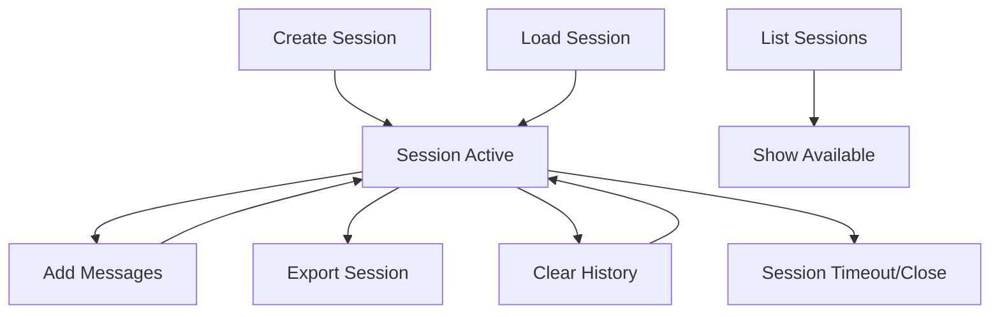

# 🚀 Synapse MCP Server - Complete Usage Guide

This comprehensive guide covers everything you need to know about using the Synapse MCP (Model Context Protocol) Server, from basic setup to advanced integration patterns with AI models.

## 📋 **Table of Contents**

1. [Quick Start](#quick-start)
2. [Installation & Setup](#installation--setup)
3. [Server Configuration](#server-configuration)
4. [Available MCP Tools](#available-mcp-tools)
5. [Transport Protocols](#transport-protocols)
6. [Client Integration](#client-integration)
7. [Session Management](#session-management)
8. [Knowledge Base Operations](#knowledge-base-operations)
9. [Advanced Usage Patterns](#advanced-usage-patterns)
10. [Troubleshooting](#troubleshooting)
11. [Production Deployment](#production-deployment)

## ⚡ **Quick Start**

Get up and running with the MCP server in 3 steps:

```bash
# 1. Install dependencies (if not already installed)
pip install websockets flask flask-cors

# 2. Start the MCP server
./launch.sh --mcp

# 3. Test with the example client
python mcp_client_example.py --demo
```

The server will start on:
- **HTTP**: `http://localhost:3000/mcp`
- **WebSocket**: `ws://localhost:3001`

## 🛠️ **Installation & Setup**

### **Prerequisites**

1. **Python Environment**
   ```bash
   python --version  # Requires Python 3.9+
   ```

2. **Virtual Environment** (Recommended)
   ```bash
   python -m venv .venv
   source .venv/bin/activate  # On Windows: .venv\Scripts\activate
   ```

3. **Dependencies**
   ```bash
   # Install from requirements.txt (includes MCP dependencies)
   pip install -r requirements.txt
   
   # Or install manually
   pip install websockets flask flask-cors
   ```

4. **Environment Variables**
   ```bash
   export LITELLM_API_KEY=your_api_key_here
   export LITELLM_BASE_URL=https://litellm-proxy--tenstorrent.workload.tenstorrent.com/
   ```

5. **Knowledge Base Initialization**
   ```bash
   # Initialize your knowledge base
   python initialize_fast.py
   ```

### **Verification**

Run the test suite to ensure everything is working:

```bash
python test_mcp_server.py

# Expected output:
# 🎉 All tests passed! MCP server is ready to use.
```

## ⚙️ **Server Configuration**

### **Command Line Options**

```bash
python mcp_server.py --help
```

**Available Options:**
- `--transport {http,websocket,both}` - Transport protocol(s) to use
- `--http-port PORT` - HTTP server port (default: 3000)
- `--ws-port PORT` - WebSocket server port (default: 3001)
- `--artifacts-dir DIR` - Directory containing knowledge bases (default: artifacts)
- `--debug` - Enable debug mode with detailed logging
- `--cors` - Enable CORS for HTTP transport (default: enabled)

### **Configuration File** (`mcp_config.json`)

```json
{
  "server": {
    "name": "synapse-rag-server",
    "version": "1.0.0",
    "description": "Synapse RAG Knowledge Base MCP Server"
  },
  "transports": {
    "http": {
      "enabled": true,
      "port": 3000,
      "cors": true,
      "debug": false
    },
    "websocket": {
      "enabled": true,
      "port": 3001
    }
  },
  "knowledge_base": {
    "artifacts_dir": "artifacts",
    "default_kb": null,
    "auto_initialize": true
  },
  "logging": {
    "level": "INFO",
    "file": "mcp_server.log",
    "max_file_size": "10MB",
    "backup_count": 5
  },
  "session": {
    "auto_save": true,
    "session_timeout": 3600,
    "max_sessions": 100
  },
  "security": {
    "allowed_origins": ["*"],
    "bind_address": "0.0.0.0",
    "require_auth": false
  }
}
```

### **Startup Methods**

**Method 1: Launch Script (Recommended)**
```bash
./launch.sh --mcp              # Both HTTP + WebSocket
./launch.sh --mcp-http         # HTTP only
./launch.sh --mcp-ws           # WebSocket only
```

**Method 2: Dedicated MCP Script**
```bash
./start_mcp_server.sh                           # Default configuration
./start_mcp_server.sh --transport http          # HTTP only
./start_mcp_server.sh --debug                   # Debug mode
```

**Method 3: Direct Python Execution**
```bash
python mcp_server.py --transport both --debug
```

## 🛠️ **Available MCP Tools**

The MCP server exposes **14 tools** that mirror all CLI functionality:

### **1. Query & Interaction Tools**

#### **`ask_question`**
Ask questions with conversation context and session memory.

```json
{
  "name": "ask_question",
  "arguments": {
    "question": "What are the key features of the Tensix architecture?",
    "session_id": "research_session",
    "verbose": false,
    "timeout": 60
  }
}
```

**Parameters:**
- `question` (string, required): The question to ask
- `session_id` (string, optional): Session ID for conversation context
- `verbose` (boolean, optional): Enable detailed retrieval information
- `timeout` (number, optional): Query timeout in seconds

**Response:**
```json
{
  "answer": "The Tensix architecture features...",
  "sources": [
    {
      "document": "tensix_manual.pdf",
      "page": 15,
      "relevance": 0.92
    }
  ],
  "images": ["tensix_diagram_p15.png"],
  "session_id": "research_session",
  "verbose_info": {...}
}
```

#### **`set_verbose_mode`**
Enable or disable verbose retrieval mode globally.

```json
{
  "name": "set_verbose_mode",
  "arguments": {
    "verbose": true
  }
}
```

#### **`get_server_info`**
Get comprehensive server status and configuration.

```json
{
  "name": "get_server_info",
  "arguments": {}
}
```

**Response includes:**
- Server version and uptime
- Current knowledge base
- Available knowledge bases
- Active sessions count
- Transport status
- Performance metrics

### **2. Knowledge Base Management**

#### **`list_knowledge_bases`**
List all available knowledge bases with statistics.

```json
{
  "name": "list_knowledge_bases",
  "arguments": {}
}
```

**Response:**
```json
[
  {
    "name": "Aahan_s_Notes",
    "display_name": "Aahan's Notes",
    "chunk_count": 2543,
    "file_size": 45678123,
    "is_current": true
  },
  {
    "name": "hash_Confluence_Architecture", 
    "display_name": "#Confluence Architecture",
    "chunk_count": 1234,
    "file_size": 23456789,
    "is_current": false
  }
]
```

#### **`switch_knowledge_base`**
Switch to a different knowledge base in real-time.

```json
{
  "name": "switch_knowledge_base", 
  "arguments": {
    "knowledge_base": "Ascalon_Docs"
  }
}
```

**Response:**
```json
{
  "switched_to": "Ascalon_Docs",
  "display_name": "Ascalon Docs",
  "chunk_count": 3456,
  "file_size": 78901234
}
```

#### **`get_kb_stats`**
Get detailed statistics about current or specified knowledge base.

```json
{
  "name": "get_kb_stats",
  "arguments": {
    "knowledge_base": "Aahan_s_Notes"  // Optional
  }
}
```

### **3. Session Management**

#### **`create_session`**
Create a new conversation session.

```json
{
  "name": "create_session",
  "arguments": {
    "session_id": "ai_conversation_001"  // Optional custom ID
  }
}
```

#### **`load_session`**
Load an existing session from file.

```json
{
  "name": "load_session",
  "arguments": {
    "session_file": "sessions/chat_session_20240115_143022.json"
  }
}
```

#### **`list_sessions`**
List all available sessions.

```json
{
  "name": "list_sessions",
  "arguments": {}
}
```

**Response:**
```json
[
  {
    "session_id": "ai_conversation_001",
    "history_count": 15,
    "status": "active",
    "session_file": null
  },
  {
    "session_id": "research_session",
    "history_count": 8,
    "status": "saved",
    "session_file": "sessions/research_session.json",
    "modified_time": "2024-01-15T14:30:22"
  }
]
```

#### **`get_session_history`**
Get conversation history for a session.

```json
{
  "name": "get_session_history",
  "arguments": {
    "session_id": "ai_conversation_001",
    "limit": 10
  }
}
```

#### **`clear_session_history`**
Clear conversation history for a session.

```json
{
  "name": "clear_session_history",
  "arguments": {
    "session_id": "ai_conversation_001"
  }
}
```

#### **`export_session`**
Export session to JSON file.

```json
{
  "name": "export_session",
  "arguments": {
    "session_id": "ai_conversation_001",
    "output_file": "exported_conversation.json"
  }
}
```

### **4. Document Processing Tools**

#### **`get_processing_status`**
Get real-time document processing status.

```json
{
  "name": "get_processing_status",
  "arguments": {}
}
```

**Response:**
```json
{
  "total_folders": 5,
  "folder_status": [
    {
      "folder": "Aahan_s_Notes",
      "completed_docs": 150,
      "pending_docs": 2,
      "failed_docs": 1,
      "total_chunks": 2543,
      "embedded_chunks": 2543,
      "completion_rate": 99.3
    }
  ]
}
```

#### **`initialize_knowledge_base`**
Run knowledge base initialization with options.

```json
{
  "name": "initialize_knowledge_base",
  "arguments": {
    "folder": "MyDocs",  // Optional: specific folder
    "cleanup": true      // Optional: cleanup before processing
  }
}
```

## 🌐 **Transport Protocols**

### **HTTP Transport (JSON-RPC 2.0)**

**Endpoint:** `POST http://localhost:3000/mcp`

**Request Example:**
```bash
curl -X POST http://localhost:3000/mcp \
  -H "Content-Type: application/json" \
  -d '{
    "jsonrpc": "2.0",
    "id": 1,
    "method": "tools/call",
    "params": {
      "name": "ask_question",
      "arguments": {
        "question": "What is Synapse?",
        "session_id": "demo"
      }
    }
  }'
```

**Batch Requests:**
```json
[
  {
    "jsonrpc": "2.0",
    "id": 1,
    "method": "tools/list",
    "params": {}
  },
  {
    "jsonrpc": "2.0", 
    "id": 2,
    "method": "tools/call",
    "params": {
      "name": "get_server_info",
      "arguments": {}
    }
  }
]
```

**Health Check:**
```bash
curl http://localhost:3000/health

# Response:
{
  "status": "healthy",
  "timestamp": "2024-01-15T10:30:00Z"
}
```

### **WebSocket Transport**

**Endpoint:** `ws://localhost:3001`

**Connection Example:**
```python
import asyncio
import json
import websockets

async def test_websocket():
    uri = "ws://localhost:3001"
    
    async with websockets.connect(uri) as websocket:
        # Send initialization
        init_message = {
            "jsonrpc": "2.0",
            "id": 1,
            "method": "initialize",
            "params": {
                "protocolVersion": "2024-11-05",
                "capabilities": {"tools": {}},
                "clientInfo": {"name": "my-client", "version": "1.0.0"}
            }
        }
        
        await websocket.send(json.dumps(init_message))
        response = await websocket.recv()
        print(f"Init response: {response}")
        
        # Send tool call
        tool_message = {
            "jsonrpc": "2.0",
            "id": 2,
            "method": "tools/call", 
            "params": {
                "name": "list_knowledge_bases",
                "arguments": {}
            }
        }
        
        await websocket.send(json.dumps(tool_message))
        response = await websocket.recv()
        print(f"Tool response: {response}")

asyncio.run(test_websocket())
```

## 👥 **Client Integration**

### **Example Clients**

The repository includes a comprehensive example client (`mcp_client_example.py`) that demonstrates all functionality:

```bash
# Run full demo
python mcp_client_example.py --demo

# Interactive mode
python mcp_client_example.py --interactive

# WebSocket transport
python mcp_client_example.py --transport websocket --port 3001 --demo
```

### **Python Client Example**

```python
import asyncio
import json
import requests
from typing import Dict, Any

class SynapseMCPClient:
    def __init__(self, host: str = "localhost", port: int = 3000):
        self.base_url = f"http://{host}:{port}/mcp"
        self.message_id = 0
    
    def get_next_id(self) -> int:
        self.message_id += 1
        return self.message_id
    
    async def initialize(self) -> Dict[str, Any]:
        """Initialize MCP session"""
        message = {
            "jsonrpc": "2.0",
            "id": self.get_next_id(),
            "method": "initialize",
            "params": {
                "protocolVersion": "2024-11-05",
                "capabilities": {"tools": {}},
                "clientInfo": {"name": "synapse-client", "version": "1.0.0"}
            }
        }
        
        response = requests.post(self.base_url, json=message)
        return response.json()
    
    async def list_tools(self) -> Dict[str, Any]:
        """Get available tools"""
        message = {
            "jsonrpc": "2.0",
            "id": self.get_next_id(),
            "method": "tools/list",
            "params": {}
        }
        
        response = requests.post(self.base_url, json=message)
        return response.json()
    
    async def ask_question(self, question: str, session_id: str = "default", 
                          verbose: bool = False) -> Dict[str, Any]:
        """Ask a question"""
        message = {
            "jsonrpc": "2.0",
            "id": self.get_next_id(),
            "method": "tools/call",
            "params": {
                "name": "ask_question",
                "arguments": {
                    "question": question,
                    "session_id": session_id,
                    "verbose": verbose
                }
            }
        }
        
        response = requests.post(self.base_url, json=message)
        result = response.json()
        
        if "error" in result:
            raise Exception(f"MCP Error: {result['error']['message']}")
        
        # Parse the response content
        content = result["result"]["content"][0]["text"]
        return json.loads(content)

# Usage example
async def main():
    client = SynapseMCPClient()
    
    # Initialize
    await client.initialize()
    
    # Ask a question
    answer = await client.ask_question(
        "What are the key components of the Synapse architecture?",
        session_id="architecture_discussion"
    )
    
    print(f"Answer: {answer['answer']}")
    print(f"Sources: {len(answer.get('sources', []))} documents")

asyncio.run(main())
```

### **JavaScript/Node.js Client**

```javascript
const WebSocket = require('ws');

class SynapseMCPClient {
    constructor(url = 'ws://localhost:3001') {
        this.ws = new WebSocket(url);
        this.messageId = 0;
        this.pendingRequests = new Map();
        
        this.ws.on('message', (data) => {
            const response = JSON.parse(data);
            if (response.id && this.pendingRequests.has(response.id)) {
                const resolve = this.pendingRequests.get(response.id);
                this.pendingRequests.delete(response.id);
                resolve(response);
            }
        });
    }
    
    async sendMessage(method, params = {}) {
        return new Promise((resolve, reject) => {
            const id = ++this.messageId;
            const message = {
                jsonrpc: '2.0',
                id,
                method,
                params
            };
            
            this.pendingRequests.set(id, resolve);
            this.ws.send(JSON.stringify(message));
            
            // Timeout after 30 seconds
            setTimeout(() => {
                if (this.pendingRequests.has(id)) {
                    this.pendingRequests.delete(id);
                    reject(new Error('Request timeout'));
                }
            }, 30000);
        });
    }
    
    async initialize() {
        return await this.sendMessage('initialize', {
            protocolVersion: '2024-11-05',
            capabilities: { tools: {} },
            clientInfo: { name: 'js-client', version: '1.0.0' }
        });
    }
    
    async askQuestion(question, sessionId = 'default') {
        const response = await this.sendMessage('tools/call', {
            name: 'ask_question',
            arguments: {
                question,
                session_id: sessionId
            }
        });
        
        if (response.error) {
            throw new Error(response.error.message);
        }
        
        return JSON.parse(response.result.content[0].text);
    }
}

// Usage
(async () => {
    const client = new SynapseMCPClient();
    
    // Wait for connection
    await new Promise(resolve => {
        client.ws.on('open', resolve);
    });
    
    await client.initialize();
    
    const answer = await client.askQuestion('What is Synapse?');
    console.log('Answer:', answer.answer);
})();
```

## 💾 **Session Management**

### **Session Lifecycle**



### **Working with Sessions**

**1. Create and Use a Session**
```python
# Create session
client.call_tool("create_session", {"session_id": "research_001"})

# Use session for questions
answer1 = client.call_tool("ask_question", {
    "question": "What is the Tensix architecture?",
    "session_id": "research_001"
})

answer2 = client.call_tool("ask_question", {
    "question": "How does it compare to traditional CPU architectures?",
    "session_id": "research_001"  # Maintains context from previous question
})
```

**2. Session Persistence**
```python
# Export session for later use
client.call_tool("export_session", {
    "session_id": "research_001",
    "output_file": "research_conversation.json"
})

# Load session in future
client.call_tool("load_session", {
    "session_file": "research_conversation.json"
})
```

**3. Session Management**
```python
# List all sessions
sessions = client.call_tool("list_sessions", {})

# Get conversation history
history = client.call_tool("get_session_history", {
    "session_id": "research_001",
    "limit": 5
})

# Clear session history (keeps session active)
client.call_tool("clear_session_history", {
    "session_id": "research_001"
})
```

## 🗂️ **Knowledge Base Operations**

### **Knowledge Base Discovery**

```python
# List all available knowledge bases
kbs = client.call_tool("list_knowledge_bases", {})

for kb in kbs:
    print(f"KB: {kb['display_name']}")
    print(f"  Chunks: {kb['chunk_count']:,}")
    print(f"  Size: {kb['file_size'] / 1024 / 1024:.1f} MB")
    print(f"  Current: {'Yes' if kb['is_current'] else 'No'}")
    print()
```

### **Knowledge Base Switching**

```python
# Switch to a specific knowledge base
result = client.call_tool("switch_knowledge_base", {
    "knowledge_base": "Ascalon_Docs"
})

print(f"Switched to: {result['display_name']}")
print(f"Chunks available: {result['chunk_count']:,}")

# Now all questions will use the new knowledge base
answer = client.call_tool("ask_question", {
    "question": "What are the Ascalon specifications?",
    "session_id": "ascalon_research"
})
```

### **Knowledge Base Health Monitoring**

```python
# Get detailed KB statistics
stats = client.call_tool("get_kb_stats", {
    "knowledge_base": "Aahan_s_Notes"  # Optional, uses current if not specified
})

print(f"KB: {stats['name']}")
print(f"Documents: {stats.get('completed_docs', 'N/A')}")
print(f"Chunks: {stats.get('total_chunks', 'N/A')}")
print(f"Embeddings: {stats.get('embedded_chunks', 'N/A')}")

# Check processing status
status = client.call_tool("get_processing_status", {})
for folder_status in status['folder_status']:
    print(f"Folder: {folder_status['folder']}")
    print(f"  Completion: {folder_status['completion_rate']:.1f}%")
```

## 🎯 **Advanced Usage Patterns**

### **1. Multi-Knowledge Base Conversation**

```python
async def multi_kb_research(client, question_sets):
    """Research across multiple knowledge bases"""
    results = {}
    
    for kb_name, questions in question_sets.items():
        # Switch to knowledge base
        client.call_tool("switch_knowledge_base", {"knowledge_base": kb_name})
        
        # Create dedicated session for this KB
        session_id = f"research_{kb_name}"
        client.call_tool("create_session", {"session_id": session_id})
        
        kb_results = []
        for question in questions:
            answer = client.call_tool("ask_question", {
                "question": question,
                "session_id": session_id
            })
            kb_results.append({
                "question": question,
                "answer": answer["answer"],
                "sources": answer.get("sources", [])
            })
        
        results[kb_name] = kb_results
    
    return results

# Usage
question_sets = {
    "Aahan_s_Notes": [
        "What are the key technical concepts?",
        "What are the main challenges discussed?"
    ],
    "Ascalon_Docs": [
        "What are the processor specifications?",
        "What are the performance characteristics?"
    ]
}

research_results = await multi_kb_research(client, question_sets)
```

### **2. Batch Processing Pattern**

```python
def batch_process_questions(client, questions, session_id="batch_session"):
    """Process multiple questions efficiently"""
    
    # Create session for batch
    client.call_tool("create_session", {"session_id": session_id})
    
    results = []
    for i, question in enumerate(questions):
        print(f"Processing question {i+1}/{len(questions)}...")
        
        answer = client.call_tool("ask_question", {
            "question": question,
            "session_id": session_id,
            "verbose": False  # Disable verbose for speed
        })
        
        results.append({
            "question": question,
            "answer": answer["answer"],
            "sources": len(answer.get("sources", [])),
            "has_images": bool(answer.get("images"))
        })
    
    # Export the complete session
    client.call_tool("export_session", {
        "session_id": session_id,
        "output_file": f"batch_results_{session_id}.json"
    })
    
    return results
```

### **3. Real-time Monitoring Pattern**

```python
import time

def monitor_processing_status(client, check_interval=30):
    """Monitor document processing in real-time"""
    
    while True:
        try:
            status = client.call_tool("get_processing_status", {})
            
            print(f"\n🔄 Processing Status - {time.strftime('%Y-%m-%d %H:%M:%S')}")
            print("=" * 60)
            
            for folder in status["folder_status"]:
                completion = folder["completion_rate"]
                pending = folder.get("pending_docs", 0)
                
                status_icon = "✅" if completion >= 99.0 else "⏳" if pending > 0 else "⚠️"
                
                print(f"{status_icon} {folder['folder']:20} | "
                      f"{completion:5.1f}% | "
                      f"Pending: {pending:3d} | "
                      f"Chunks: {folder['total_chunks']:,}")
            
            # Check if all processing is complete
            all_complete = all(f["completion_rate"] >= 99.0 for f in status["folder_status"])
            
            if all_complete:
                print("\n🎉 All processing complete!")
                break
            
            time.sleep(check_interval)
            
        except KeyboardInterrupt:
            print("\n👋 Monitoring stopped by user")
            break
        except Exception as e:
            print(f"❌ Error checking status: {e}")
            time.sleep(check_interval)
```

### **4. Conversation Export and Analysis**

```python
def analyze_conversation(client, session_id):
    """Analyze conversation patterns and extract insights"""
    
    # Get full conversation history
    history = client.call_tool("get_session_history", {
        "session_id": session_id,
        "limit": 1000  # Get all history
    })
    
    # Analyze conversation
    analysis = {
        "total_exchanges": history["total_exchanges"],
        "question_types": {},
        "avg_answer_length": 0,
        "topics_discussed": set(),
        "source_documents": set()
    }
    
    total_length = 0
    for exchange in history["history"]:
        question = exchange["question"].lower()
        answer = exchange["answer"]
        
        # Categorize question types
        if "what is" in question or "what are" in question:
            analysis["question_types"]["definition"] = analysis["question_types"].get("definition", 0) + 1
        elif "how" in question:
            analysis["question_types"]["process"] = analysis["question_types"].get("process", 0) + 1
        elif "why" in question:
            analysis["question_types"]["reasoning"] = analysis["question_types"].get("reasoning", 0) + 1
        else:
            analysis["question_types"]["other"] = analysis["question_types"].get("other", 0) + 1
        
        # Track answer length
        total_length += len(answer)
        
        # Extract topics (simple keyword extraction)
        keywords = extract_keywords(question)
        analysis["topics_discussed"].update(keywords)
    
    analysis["avg_answer_length"] = total_length / len(history["history"]) if history["history"] else 0
    analysis["topics_discussed"] = list(analysis["topics_discussed"])
    
    return analysis

def extract_keywords(text):
    """Simple keyword extraction"""
    import re
    
    # Remove common words and extract meaningful terms
    stop_words = {"what", "how", "why", "when", "where", "is", "are", "the", "and", "or", "but"}
    words = re.findall(r'\b[a-zA-Z]{3,}\b', text.lower())
    return [word for word in words if word not in stop_words]
```

## 🔧 **Troubleshooting**

### **Common Issues**

**1. Connection Refused**
```bash
# Check if server is running
curl http://localhost:3000/health

# If not running, start server
./launch.sh --mcp

# Check logs
tail -f mcp_server.log
```

**2. Missing Dependencies**
```bash
# Install missing dependencies
pip install websockets flask flask-cors

# Verify installation
python -c "import websockets, flask; print('Dependencies OK')"
```

**3. Environment Variables Not Set**
```bash
# Check environment variables
echo $LITELLM_API_KEY
echo $LITELLM_BASE_URL

# Set environment variables
export LITELLM_API_KEY=your_api_key
export LITELLM_BASE_URL=https://litellm-proxy--tenstorrent.workload.tenstorrent.com/
```

**4. No Knowledge Bases Found**
```bash
# Check artifacts directory
ls -la artifacts/

# Initialize knowledge base
python initialize_fast.py

# Check initialization status
python initialize_fast.py --status

# List available knowledge bases
python chat.py --list-kb
```

**5. Permission Errors**
```bash
# Fix script permissions
chmod +x start_mcp_server.sh launch.sh

# Check file permissions
ls -la *.sh
```

### **Debug Mode**

Enable debug mode for detailed troubleshooting:

```bash
# Start server in debug mode
python mcp_server.py --debug --transport http

# Or with launch script
./start_mcp_server.sh --debug
```

Debug mode provides:
- Detailed request/response logging
- Performance timing information
- Stack traces for errors
- Connection status updates

### **Logging Configuration**

Check the MCP server log file for detailed information:

```bash
# View recent logs
tail -f mcp_server.log

# Search for errors
grep "ERROR" mcp_server.log

# Search for specific sessions
grep "session_001" mcp_server.log
```

**Log Levels:**
- **INFO**: Normal operations, successful requests
- **WARNING**: Recoverable issues, missing optional data
- **ERROR**: Failed requests, connection issues
- **DEBUG**: Detailed execution traces (debug mode only)

## 🚀 **Production Deployment**

### **Production Checklist**

- [ ] **Environment Variables**: Set in production environment
- [ ] **Knowledge Base**: Initialize and verify all KBs are accessible
- [ ] **Dependencies**: Install production dependencies
- [ ] **Logging**: Configure log rotation and monitoring
- [ ] **Security**: Review security settings and access controls
- [ ] **Performance**: Test under expected load
- [ ] **Monitoring**: Set up health checks and alerts
- [ ] **Backup**: Configure session and configuration backups

### **Docker Deployment**

```dockerfile
FROM python:3.11-slim

WORKDIR /app

# Install system dependencies
RUN apt-get update && apt-get install -y \
    build-essential \
    && rm -rf /var/lib/apt/lists/*

# Install Python dependencies
COPY requirements.txt .
RUN pip install -r requirements.txt

# Copy application code
COPY . .

# Set environment variables
ENV PYTHONPATH=/app
ENV LITELLM_API_KEY=""
ENV LITELLM_BASE_URL=""

# Expose ports
EXPOSE 3000 3001

# Health check
HEALTHCHECK --interval=30s --timeout=10s --start-period=5s --retries=3 \
    CMD curl -f http://localhost:3000/health || exit 1

# Start server
CMD ["python", "mcp_server.py", "--transport", "both", "--http-port", "3000", "--ws-port", "3001"]
```

**Build and Run:**
```bash
# Build Docker image
docker build -t synapse-mcp-server .

# Run container
docker run -d \
    -p 3000:3000 \
    -p 3001:3001 \
    -e LITELLM_API_KEY=your_key \
    -e LITELLM_BASE_URL=your_url \
    -v $(pwd)/artifacts:/app/artifacts \
    -v $(pwd)/sessions:/app/sessions \
    --name synapse-mcp \
    synapse-mcp-server
```

### **Kubernetes Deployment**

```yaml
apiVersion: apps/v1
kind: Deployment
metadata:
  name: synapse-mcp-server
spec:
  replicas: 2
  selector:
    matchLabels:
      app: synapse-mcp
  template:
    metadata:
      labels:
        app: synapse-mcp
    spec:
      containers:
      - name: mcp-server
        image: synapse-mcp-server:latest
        ports:
        - containerPort: 3000
        - containerPort: 3001
        env:
        - name: LITELLM_API_KEY
          valueFrom:
            secretKeyRef:
              name: litellm-secrets
              key: api-key
        - name: LITELLM_BASE_URL
          value: "https://litellm-proxy--tenstorrent.workload.tenstorrent.com/"
        volumeMounts:
        - name: artifacts
          mountPath: /app/artifacts
        - name: sessions
          mountPath: /app/sessions
        livenessProbe:
          httpGet:
            path: /health
            port: 3000
          initialDelaySeconds: 30
          periodSeconds: 10
        readinessProbe:
          httpGet:
            path: /health
            port: 3000
          initialDelaySeconds: 5
          periodSeconds: 5
      volumes:
      - name: artifacts
        persistentVolumeClaim:
          claimName: synapse-artifacts
      - name: sessions
        persistentVolumeClaim:
          claimName: synapse-sessions

---
apiVersion: v1
kind: Service
metadata:
  name: synapse-mcp-service
spec:
  selector:
    app: synapse-mcp
  ports:
  - name: http
    port: 3000
    targetPort: 3000
  - name: websocket
    port: 3001
    targetPort: 3001
  type: LoadBalancer
```

### **Monitoring and Alerts**

**Prometheus Metrics:**
```yaml
# Add to your Prometheus configuration
- job_name: 'synapse-mcp'
  static_configs:
  - targets: ['localhost:3000']
  metrics_path: '/metrics'
  scrape_interval: 15s
```

**Health Check Script:**
```bash
#!/bin/bash
# health_check.sh

HEALTH_URL="http://localhost:3000/health"
MAX_RETRIES=3
RETRY_COUNT=0

while [ $RETRY_COUNT -lt $MAX_RETRIES ]; do
    if curl -f $HEALTH_URL > /dev/null 2>&1; then
        echo "✅ MCP Server is healthy"
        exit 0
    else
        RETRY_COUNT=$((RETRY_COUNT + 1))
        echo "⚠️ Health check failed, retry $RETRY_COUNT/$MAX_RETRIES"
        sleep 5
    fi
done

echo "❌ MCP Server health check failed after $MAX_RETRIES attempts"
exit 1
```

This comprehensive usage guide provides everything needed to effectively use the Synapse MCP Server, from basic setup to advanced production deployment patterns. The server provides a robust, scalable bridge between your Synapse knowledge base and AI models via the standardized MCP protocol.
